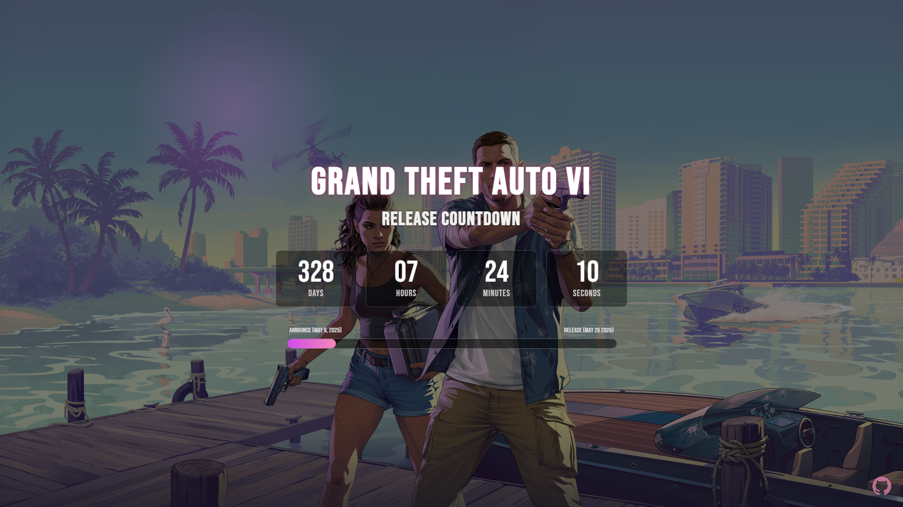

# GTA VI Countdown Timer

A stylish and animated countdown page for the highly anticipated release of Grand Theft Auto VI, built with Angular. This project features a real-time timer, a progress bar tracking the time since the announcement, and dynamic, atmospheric background effects.

## ✨ Live Demo

View the live project deployed on Vercel:

**[gta6-countdown-one.vercel.app](https://gta6-countdown-one.vercel.app/)**

## 📸 Screenshot

## 🚀 Features

-   **Real-time Countdown:** Displays the remaining days, hours, minutes, and seconds until the estimated release date.
-   **Dynamic Progress Bar:** Shows the percentage of time that has elapsed since the official announcement trailer relative to the estimated release date.
-   **Animated Background:** A subtle, figure-eight pink glow moves across the background, creating an atmospheric "Vice City" neon vibe.
-   **Responsive Design:** The layout is optimized for both desktop and mobile devices.
-   **Themed UI:** Uses the "Bebas Neue" font and a color scheme inspired by the official GTA VI artwork.
-   **Source Code Link:** Includes a direct link to this GitHub repository for easy viewing.

## 🛠️ Tech Stack

-   **[Angular](https://angular.dev/)**
-   **[TypeScript](https://www.typescriptlang.org/)**
-   **HTML5 & CSS3** (Leveraging modern features like CSS Animations and `mix-blend-mode`)
-   **[Vercel](https://vercel.com/)** for continuous deployment.